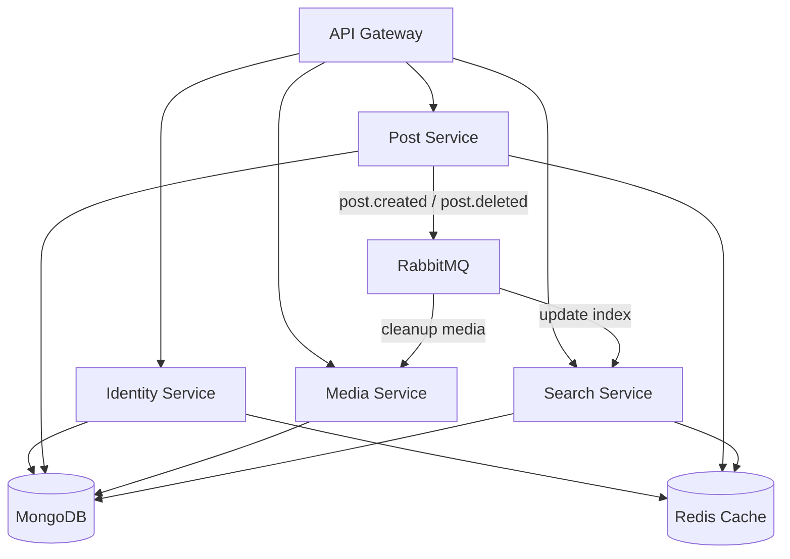
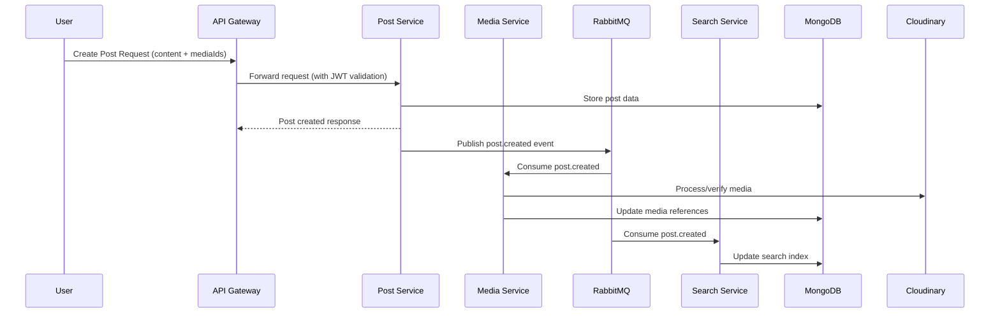

# 🌐 Distributed Social Media Platform (Microservices)

A scalable microservices-based backend system for a social media platform, designed to handle user authentication, post management, media uploads, and search using event-driven architecture.

---

## 🚀 Overview

This system is built using a **microservices architecture**, where each service is independently responsible for a specific domain (auth, posts, media, search). Communication between services is handled asynchronously using **RabbitMQ**, ensuring scalability and loose coupling.

---

## 🛠 Tech Stack

Backend: Node.js, Express (Microservices)  
API Gateway: Express (Proxy + JWT Validation)  
Database: MongoDB (Mongoose)  
Caching & Rate Limiting: Redis  
Messaging: RabbitMQ  
Media Storage: Cloudinary  
Authentication: JWT (Access + Refresh Tokens)

---

## ✨ Core Features

### 🔐 Authentication (Identity Service)
- User registration & login  
- JWT-based access + refresh token flow  
- Refresh token rotation & logout  
- Rate limiting on sensitive endpoints  

---

### 📝 Post Management (Post Service)
- Create posts (with optional media)  
- Fetch paginated posts  
- Fetch individual post (with caching)  
- Delete user-owned posts  
- Redis-based caching with invalidation  

---

### 🖼 Media Handling (Media Service)
- Upload media to Cloudinary  
- Retrieve user media  
- Automatic cleanup of media on post deletion (event-driven)  

---

### 🔎 Search (Search Service)
- Full-text search using MongoDB `$text` indexing  
- Dedicated search collection for optimized reads  
- Updated asynchronously via events  

---

### ⚡ Event-Driven Architecture
- RabbitMQ used for inter-service communication  
- Post Service publishes:
  - post.created
  - post.deleted  
- Search & Media services consume events to stay in sync  

---

## 🏗 Architecture

MongoDB (Primary DB) used across services  
Redis used for caching and rate limiting  

---

## 🏗 Sequence Diagram

MongoDB (Primary DB) used across services  
Redis used for caching and rate limiting  

---

## 🔗 API Overview

Auth
- POST /v1/auth/register
- POST /v1/auth/login
- POST /v1/auth/refresh-token
- POST /v1/auth/logout

Posts
- POST /v1/posts/create-post
- GET /v1/posts/all-posts?page=1&limit=10
- GET /v1/posts/:id
- DELETE /v1/posts/:id

Media
- POST /v1/media/upload
- GET /v1/media/get

Search
- GET /v1/search/posts?query=<text>

---

## ⚙️ Local Setup

### 1. Prerequisites
- Node.js 20+
- MongoDB (Atlas / local)
- Redis
- RabbitMQ
- Cloudinary account

---

### 2. Environment Setup

API Gateway
PORT=
IDENTITY_SERVICE_URL=
POST_SERVICE_URL=
MEDIA_SERVICE_URL=
SEARCH_SERVICE_URL=
REDIS_URL=
JWT_SECRET=

Identity Service
PORT=
MONGODB_URI=
JWT_SECRET=
REDIS_URL=

Post Service
PORT=
MONGODB_URI=
JWT_SECRET=
REDIS_URL=
RABBITMQ_URL=

Media Service
PORT=
MONGODB_URI=
RABBITMQ_URL=
CLOUDINARY_CLOUD_NAME=
CLOUDINARY_API_KEY=
CLOUDINARY_API_SECRET=

Search Service
PORT=
MONGODB_URI=
REDIS_URL=
RABBITMQ_URL=

---

### 3. Run Services

cd api-gateway && npm install && npm run dev
cd identity-service && npm install && npm run dev
cd post-service && npm install && npm run dev
cd media-service && npm install && npm run dev
cd search-service && npm install && npm run dev

---

### Docker (Optional)

docker-compose up --build

---

## 🧠 Key Design Highlights

- Microservices architecture for scalability and separation of concerns  
- Event-driven communication using RabbitMQ  
- API Gateway for centralized auth and routing  
- Redis caching to reduce DB load  
- Asynchronous processing for better performance under load  

---

## 👨‍💻 Author

Ashish Khoda
